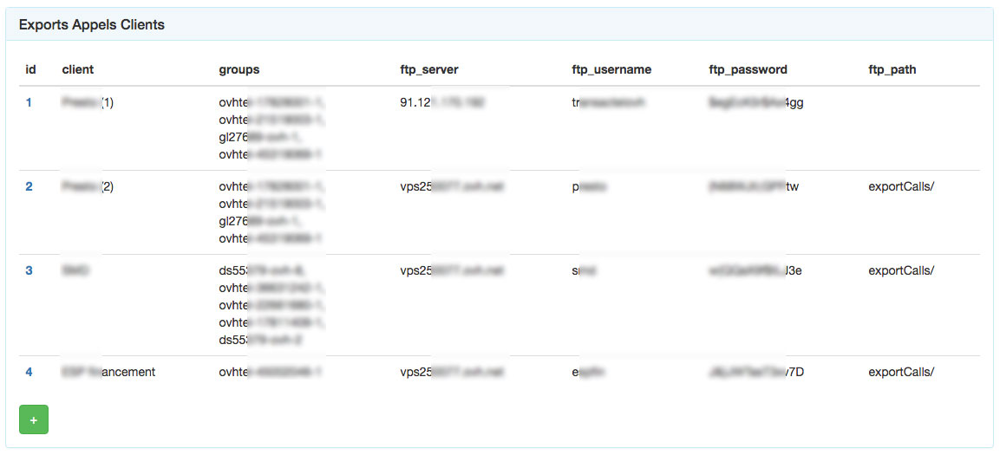
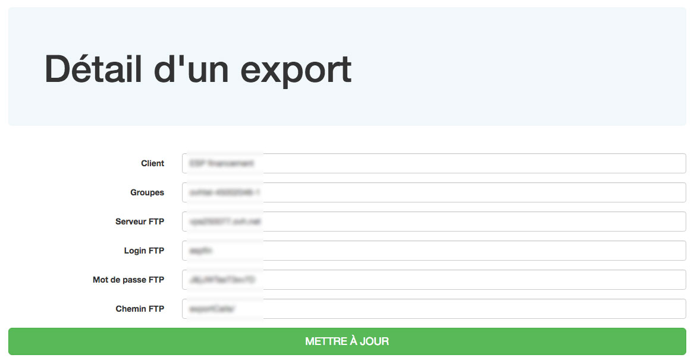

# Exports des informations d'appels (CSV)
Certains de vos clients souhaiteront disposer de leurs CDR (Call Record Data), informations d'appels au format CSV), au jour le jour.

BlueRockTEL dispose d'une fonctionnalité facile à mettre en oeuvre pour cela.

Il vous suffira d'ajouter une ligne aux Exports Appels Clients, en précisant :
* le nom du client,
* son ou ses groupes de facturation,
* les coordonnées FTP (serveur, utilisateur, mot de passe),
* le chemin (le cas échéant).

Une fois ces paramètres entrés, les fichiers CSV seront déposés chaque nuit dans l'espace FTP indiqué.

A noter que vous pouvez utiliser :
* soit un espace FTP appartenant à votre client,
* soit mettre vous-mêmes un serveur FTP à la disposition de vos clients.

Dans ce cas, nous vous donnerons un script à installer sur votre serveur FTP, qui synchronisera automatiquement les comptes FTP avec les informations entrées dans BlueRockTEL, de telle sorte que vous n'ayiez pas à saisir les mêmes informations à deux reprises.

Nous pouvons également, si vous le souhaitez, nous charger de la fourniture et de la maintenance du serveur FTP.

