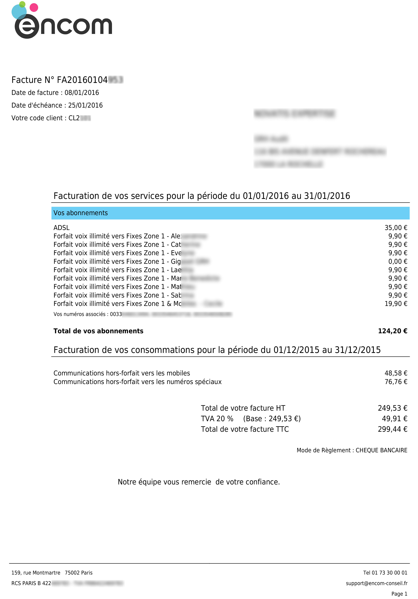
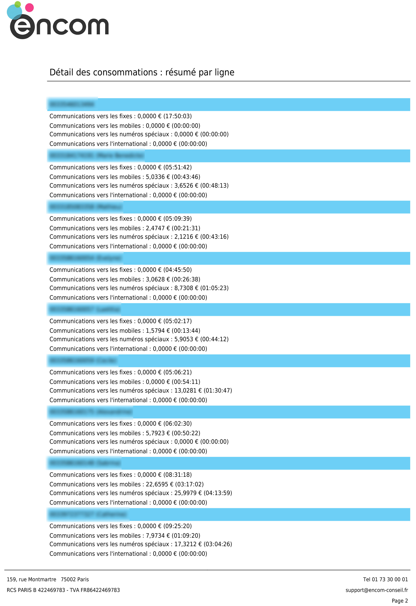
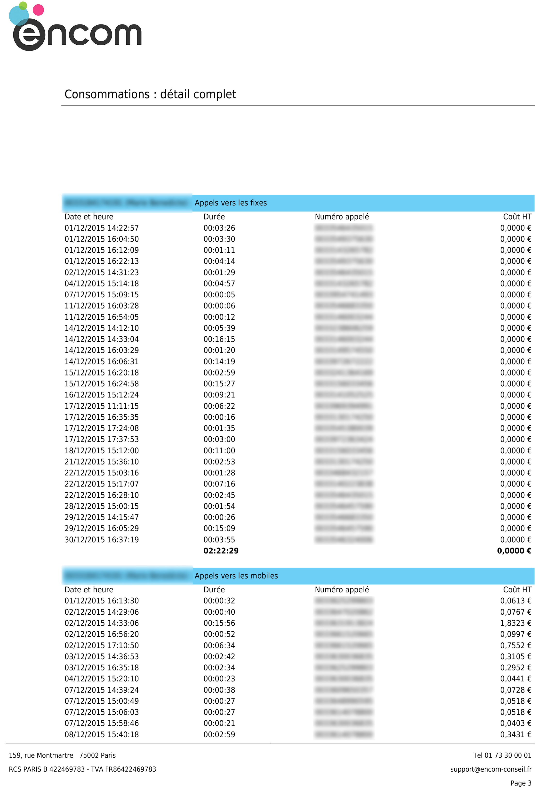

# La facture BlueRockTEL

**La facture BlueRockTEL est composée de 3 parties**.

**Dans la première**, sont présentés de façon distincte :
* les **services récurrents** (abonnements) pour le mois en cours,
* les **consommations** du mois précédent,
* les **prestations ponctuelles facturées, le cas échéant.
**
Ainsi, un simple coup d'oeil suffit au destinataire de la facture pour connaître le montant de ses abonnements, celui de ses consommations et celui des prestations ponctuelles.

Sont également rappelés de façon synthétique les **numéros associés** au compte.

De façon très classique, on trouve en entête le numéro de facture, les dates de facturation et d'échéances, ainsi que les coordonnées du client ; et en bas de page, totaux HT et TTC, montant de la TVA, et mode de règlement.

**On trouve en deuxième partie un résumé, ligne par ligne, du détail des consommations** : cette présentation synthétique permet de voir en un coup d'oeil le temps de communication et le montant facturé pour chaque catégorie d'appels :
* communications vers les fixes,
* communications vers les mobiles,
* communications vers les numéros spéciaux,
* communications vers l'international.

**Enfin, le détail complet des consommations**, qui reprend tous les appels de la période facturée, avec les informations suivantes :
* date et heure
* durée,
* numéro appelé,
* coût de l'appel.

---

---

---

